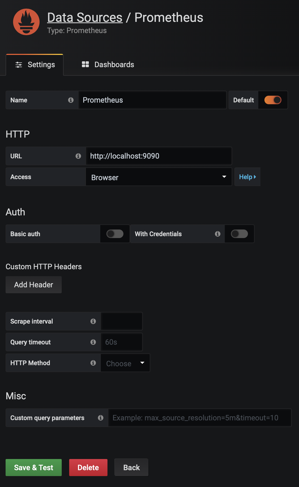

# People distribution using FogFlow
## Abstract
The organizers of an exhibition with several booths are trying to avoid overcrowding, so visitors could be distributed smoothly and enjoy the exhibition. They mount sensors at each booth so to know the number of people currently at each booth. Each booth has an informative panel which, based on the data from other booths, suggests visitors the closest booth to visit next in a way that the population is smoothly distributed. The overall number of visitors of each booth is reported to the cloud for information aggregation to be queried for the crowded time of the day and other metrics.

## How to run
#### Requirements
* node
* angular
* docker
* docker-compose
* curl

If you want to modify the fog function:
* maven
* account on docker hub

#### Run
Update with your ip (if running on your machine only update the ones with *):
* main/start.sh
* main/config.json * (update with your internal ip)
* main/prometheus.yml * (update with your internal ip)
* dashboard/proxy.js * (update with your internal ip, PROVIDING_APPLICATION only)
* dashboard/src/app/app.component.ts
* dashboard/src/app/app.module.ts

Run inside main folder:
```console
./start.sh
```
You can then find FogFlow [here][1].

You can then find Grafana [here][2] (data visualization tool, username & password: admin).
How to configure:



Wait 15 secs.

Run inside dashboard folder:
```console
npm run start_dashboard
npm run start_server
```
You can then find the people counter dashboard [here][3].

[1]: http://localhost
[2]: http://localhost:3000
[3]: http://localhost:4200

## Docs

Inside docs folder.
